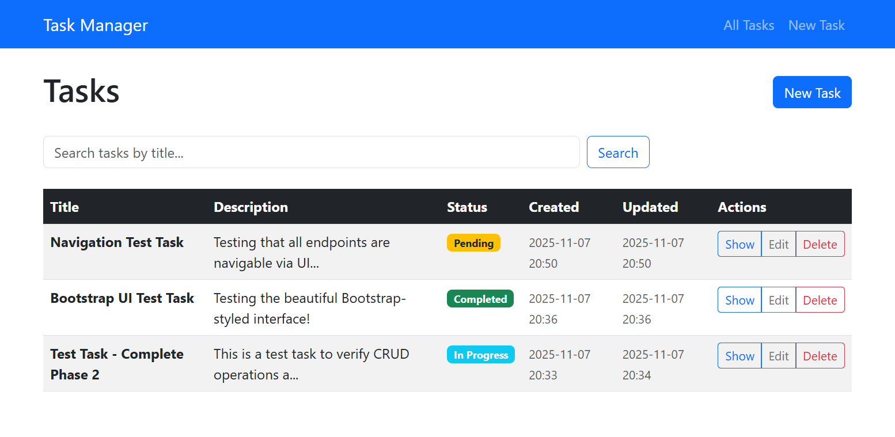
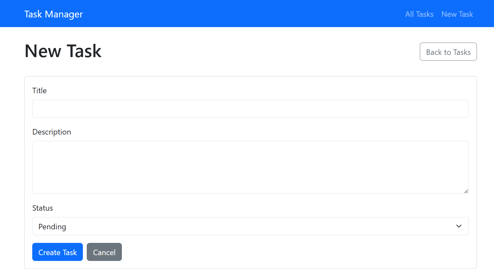
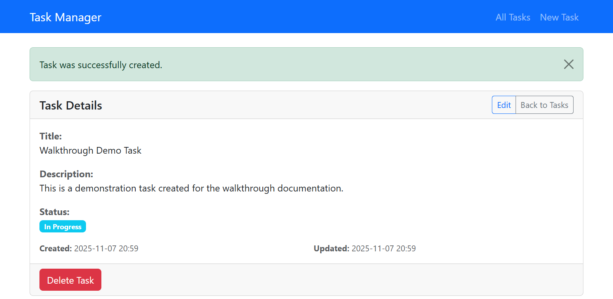
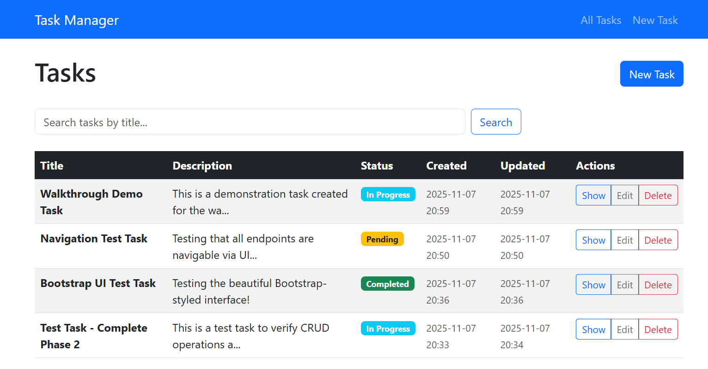
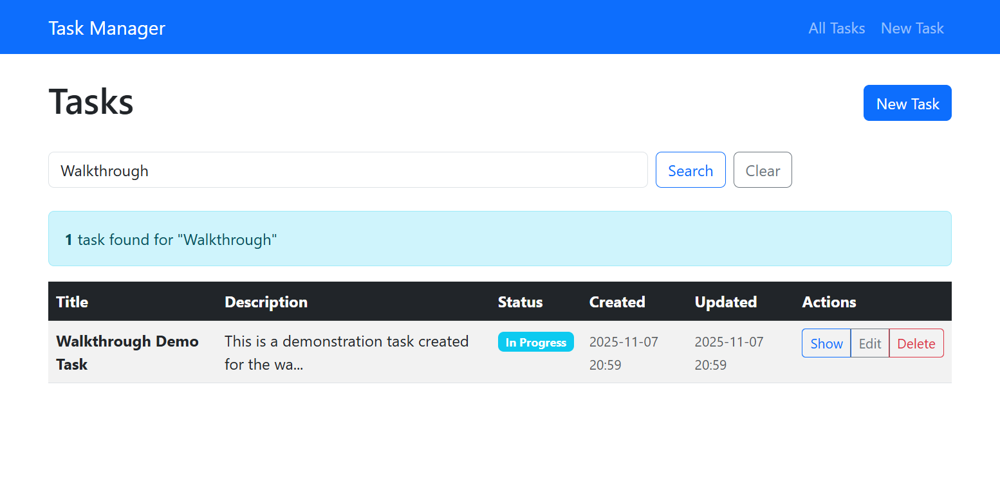
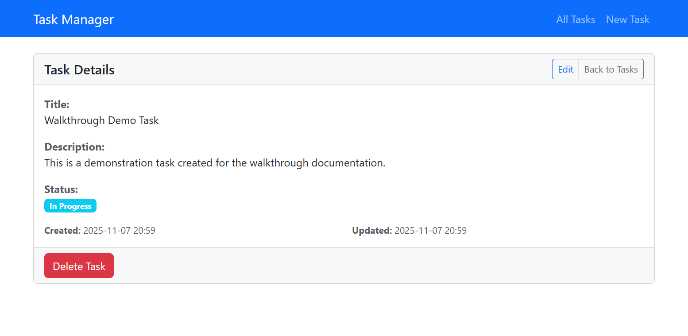
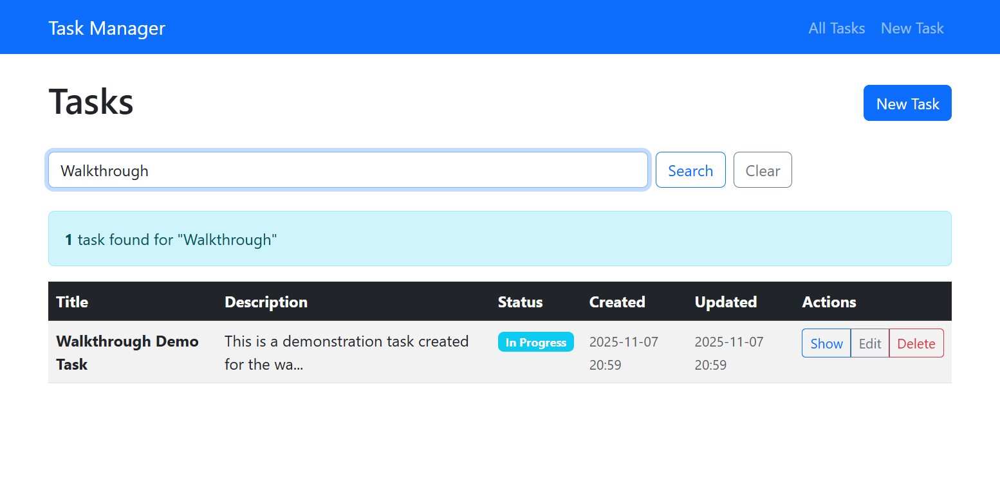

# Task Manager - Application Walkthrough

This document provides a visual walkthrough of the Task Manager application, demonstrating all features and user interactions.

## Table of Contents

1. [Home Page - Task List](#1-home-page---task-list)
2. [Creating a New Task](#2-creating-a-new-task)
3. [Task Created Successfully](#3-task-created-successfully)
4. [Viewing All Tasks](#4-viewing-all-tasks)
5. [Searching Tasks](#5-searching-tasks)
6. [Viewing Task Details](#6-viewing-task-details)
7. [Editing a Task](#7-editing-a-task)
8. [Task Updated Successfully](#8-task-updated-successfully)
9. [Final Task List](#9-final-task-list)

---

## 1. Home Page - Task List

The application starts at the home page, which displays all tasks in a responsive Bootstrap table.

**Features visible:**
- **Navigation Bar:** Fixed top navbar with "Task Manager" branding and quick links
- **Task Table:** Displays all tasks with columns for Title, Description, Status, Created, Updated, and Actions
- **Search Form:** Inline search box to filter tasks by title
- **Status Badges:** Color-coded status indicators (Pending = Yellow, In Progress = Blue, Completed = Green)
- **Action Buttons:** Each task has Show, Edit, and Delete buttons

**Navigation Options:**
- Click "Task Manager" in navbar → Returns to home
- Click "All Tasks" in navbar → Goes to tasks list
- Click "New Task" → Opens task creation form

---

## 2. Creating a New Task

Click "New Task" from the navbar or the button on the home page to create a new task.

**Form Fields:**
- **Title** (required): Text input for task title
- **Description** (optional): Textarea for task description
- **Status** (defaults to "Pending"): Dropdown with three options:
  - Pending
  - In Progress
  - Completed

**Actions:**
- **Create Task:** Submits the form and creates the task
- **Cancel:** Returns to the task list without saving
- **Back to Tasks:** Navigation link to return to list

---

## 3. Task Created Successfully

After submitting the form, the application redirects to the task detail page with a success message.

**Success Indicators:**
- Green alert banner: "Task was successfully created."
- Task details displayed in a Bootstrap card
- All task information visible (Title, Description, Status, Created/Updated timestamps)

**Available Actions:**
- **Edit:** Opens the edit form
- **Back to Tasks:** Returns to the task list
- **Delete Task:** Removes the task (with confirmation)

---

## 4. Viewing All Tasks

The task list page shows all tasks in a sortable, searchable table.

**Table Features:**
- **Responsive Design:** Table adapts to screen size
- **Hover Effects:** Rows highlight on hover for better UX
- **Status Badges:** Visual status indicators with color coding
- **Action Buttons:** Quick access to Show, Edit, Delete for each task
- **Search Bar:** Always visible at the top for quick filtering

**Task Information Displayed:**
- Title (bold, prominent)
- Description (truncated with ellipsis if long)
- Status (color-coded badge)
- Created timestamp
- Updated timestamp
- Action buttons (Show, Edit, Delete)

---

## 5. Searching Tasks

The search functionality allows filtering tasks by title (case-insensitive).

**Search Features:**
- **Case-Insensitive:** Searches work regardless of capitalization
- **Partial Matching:** Finds tasks containing the search term anywhere in the title
- **Results Count:** Displays number of matching tasks
- **Clear Link:** Appears after search to reset and show all tasks

**Example:**
- Searching for "Walkthrough" finds "Walkthrough Demo Task"
- Search results show: "1 task found for 'Walkthrough'"
- Clear link available to return to full list

---

## 6. Viewing Task Details

Click "Show" on any task to view its complete details.

**Detail View Features:**
- **Bootstrap Card Layout:** Clean, organized presentation
- **Complete Information:** All task fields displayed
- **Timestamps:** Created and Updated dates shown
- **Status Badge:** Color-coded status indicator
- **Action Buttons:**
  - Edit: Opens edit form
  - Back to Tasks: Returns to list
  - Delete Task: Removes task

**Information Displayed:**
- Title
- Description (full text, not truncated)
- Status (with color-coded badge)
- Created date and time
- Updated date and time

---

## 7. Editing a Task

Click "Edit" from the task detail page or from the task list to modify a task.

**Edit Form Features:**
- **Pre-filled Fields:** All current task data is loaded
- **Same Fields as Create:** Title, Description, Status
- **Status Dropdown:** Current status is selected
- **Navigation Links:**
  - Show Task: Returns to detail view
  - Back to Tasks: Returns to list
- **Actions:**
  - Update Task: Saves changes
  - Cancel: Discards changes and returns to list

**Form Validation:**
- Title is required (cannot be empty)
- Status must be one of: Pending, In Progress, Completed

---

## 8. Task Updated Successfully

After updating a task, a success message confirms the changes.

**Success Indicators:**
- Green alert banner: "Task was successfully updated."
- Updated timestamp reflects the change time
- All changes are immediately visible

**Example Update:**
- Changed status from "In Progress" to "Completed"
- Updated timestamp shows the modification time
- Status badge changes to green "Completed" badge

---

## 9. Final Task List

The task list reflects all changes, showing the updated status and information.

**List Features:**
- **Real-time Updates:** Changes immediately visible in the list
- **Status Changes:** Updated status badges reflect current state
- **Chronological Order:** Tasks sorted by creation date (newest first)
- **Complete Actions:** All CRUD operations accessible from this view

---

## User Journey Summary

### Complete Workflow

1. **View Tasks** → Home page shows all tasks
2. **Create Task** → Click "New Task" → Fill form → Submit
3. **View Details** → Click "Show" on any task
4. **Edit Task** → Click "Edit" → Modify fields → Update
5. **Search Tasks** → Type in search box → View filtered results
6. **Delete Task** → Click "Delete" → Confirm removal

### Navigation Paths

All functionality is accessible via UI clicks - no need to type URLs:

- **Navbar Links:**
  - Task Manager → Home page
  - All Tasks → Task list
  - New Task → Create form

- **Table Actions:**
  - Show → Task details
  - Edit → Edit form
  - Delete → Remove task

- **Page Actions:**
  - Back to Tasks → Return to list
  - Cancel → Discard changes
  - Create/Update Task → Save changes

### Key Features Demonstrated

✅ **CRUD Operations:** Create, Read, Update, Delete all functional  
✅ **Search Functionality:** Case-insensitive title search  
✅ **Responsive Design:** Works on mobile, tablet, desktop  
✅ **User Feedback:** Flash messages for all actions  
✅ **Status Management:** Visual status indicators with color coding  
✅ **Navigation:** Intuitive navigation throughout the app  
✅ **Form Validation:** Required fields and status validation  
✅ **Bootstrap UI:** Clean, modern interface  

---

## Technical Notes

- All screenshots taken from the live application running in Docker
- Application accessible at `http://localhost:3000`
- All features tested and verified working
- No console errors or warnings
- Responsive design tested across screen sizes

---

**Last Updated:** 2025-11-07  
**Application Version:** 1.0.0  
**Status:** Production Ready

